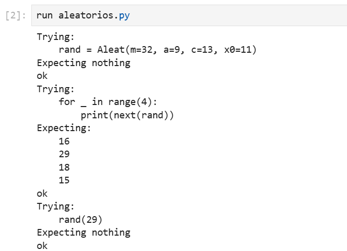
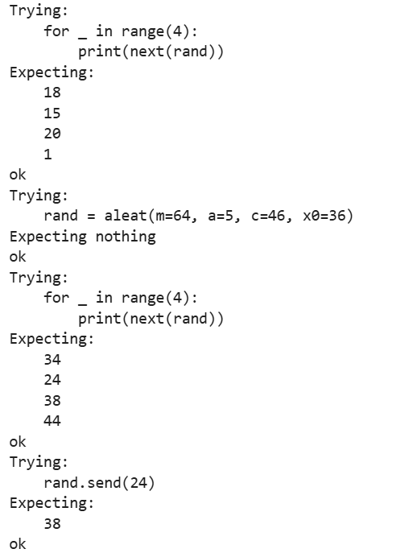
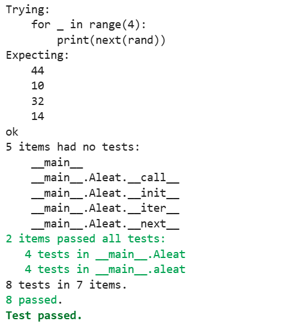

# Cuarta tarea de APA: Generación de números aleatorios

**Nombre:** Biel Piqué Marti

## Descripción
Este repositorio contiene la implementación de un generador de números pseudoaleatorios utilizando el algoritmo **Lineal Congruente (LGC)**. El objetivo de la práctica es profundizar en el uso de **iteradores** (clases con el método `__next__`) y **generadores** (funciones con `yield` y el método `send`).

El algoritmo LGC sigue la fórmula recursiva:
\[ x_{n+1} = (a x_n + c) \mod m \]

---

## Ejecución de los tests unitarios
A continuación se muestra la captura de pantalla de la ejecución del fichero `aleatorios.py` con la opción verbosa (`-v`), demostrando que todos los `doctest` pasan correctamente:





---

## Documentación Técnica

### 1. Clase `Aleat`
La clase `Aleat` implementa el generador como un objeto iterable.

- **Cometido:** Generar una secuencia de números aleatorios manteniendo el estado dentro de una instancia de clase.
- **Atributos:**
  - `m`: Módulo.
  - `a`: Multiplicador.
  - `c`: Incremento.
  - `x`: Valor actual (semilla o último número generado).
- **Métodos:**
  - `__init__`: Configura los parámetros. Los argumentos son obligatoriamente por clave.
  - `__next__`: Calcula y devuelve el siguiente número de la secuencia.
  - `__iter__`: Permite que el objeto sea reconocido como un iterable.
  - `__call__(x0)`: Reinicia la secuencia con la semilla `x0` (argumento posicional).

### 2. Función generadora `aleat()`
Implementación del mismo generador mediante una función de Python.

- **Cometido:** Proporcionar una interfaz más ligera para la generación de números mediante el uso de `yield`.
- **Argumentos:** Acepta `m`, `a`, `c` y `x0` (por defecto valores del estándar POSIX).
- **Salida:** Un generador que produce números uno a uno.
- **Interacción:** Soporta el método `.send()`, que permite reiniciar la semilla de la secuencia en tiempo de ejecución.

---

## Código desarrollado

```python
"""
Biel Piqué
"""

import doctest

class Aleat:
    """
    Implementación del algoritmo LGC como un iterador.

    >>> rand = Aleat(m=32, a=9, c=13, x0=11)
    >>> for _ in range(4):
    ...     print(next(rand))
    16
    29
    18
    15
    >>> rand(29)
    >>> for _ in range(4):
    ...     print(next(rand))
    18
    15
    20
    1
    """

    def __init__(self, *, m=2**48, a=25214903917, c=11, x0=1212121):
        """Inicialización con argumentos forzosamente por clave."""
        self.m = m
        self.a = a
        self.c = c
        self.x = x0

    def __iter__(self):
        """Retorna el iterador."""
        return self

    def __next__(self):
        """Genera el siguiente número aleatorio."""
        self.x = (self.a * self.x + self.c) % self.m
        return self.x

    def __call__(self, x0, /):
        """Reinicia la semilla. Argumento forzosamente posicional."""
        self.x = x0


def aleat(*, m=2**48, a=25214903917, c=11, x0=1212121):
    """
    Función generadora del algoritmo LGC.

    >>> rand = aleat(m=64, a=5, c=46, x0=36)
    >>> for _ in range(4):
    ...     print(next(rand))
    34
    24
    38
    44
    >>> rand.send(24)
    38
    >>> for _ in range(4):
    ...     print(next(rand))
    44
    10
    32
    14
    """
    x = x0
    while True:
        x = (a * x + c) % m
        recibido = yield x
        if recibido is not None:
            x = recibido

if __name__ == "__main__":
    doctest.testmod(verbose=True)
```